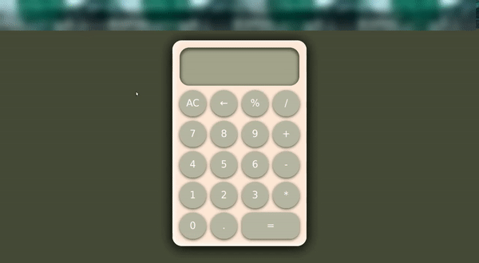

# Calculator 

The classic calculator project!  
This was the final project of the foundations Javascript course.

### Functionality

* Basic calculator functionality (this is not a scientific calculator)
* Can handle consecutive operations without pushing equals in between
* Shortens decimals
* Backspace and clear buttons
* Divide by 0 for an explosive surprise!
* Arranged with Flexbox
* CSS animations when hovering over buttons

### Demo Video

Click here for a [Live Demo](https://replit.com/@brenttbarness/Calculator?v=1) 

# Reflections After Completion

I learned so much from this project! Mostly, I feel like this solidified my foundations of javascript, which is why I suppose The Odin Project made it the culminating project for the foundations program!

### Critiques

The thing I had to copy and paste for was the operate function. The math expression was stored in a variable as a string. Therefore, I had to parse that somehow, and then operate on the expression. I needed this function to parse the expression. I felt semi-ashamed to copy and paste it, but I took an entire evening to sit down to understand WHY the function worked, and I understand at least 90% of it now. 

One of the most humbling things about this project was showing it off to people. I would say, "Check out this calculator I made!" I would be proud of it because I fixed SO MANY TINY LITTLE bugs, and they would be like, "...Yeah that's just like every other calculator," to which I would respond, "I KNOW!" People don't necessarily appreciate things that work as they should. I guess something that runs smoothly is a simple pleasure that developers have to find satisfaction in themselves. 

### Wins

My favorite thing about this project was that I felt like a REAL problem solver. I never had to ask for help from the discord server. I was able to figure out the majority of it with the basics I learned. The rest, I was able to solve with google searches.

One of the coolest, yet most simple things I learned about was latches. I came to instances where I only wanted an if statement to run once. I looked that up and came across the concept of latches. I was then able to solve so many simple problems with this concept. I don't know if it's the most efficient way of solving the problems I had. However, this is basics, and I was able to accomplish the goal at hand for now. 

Another thing I enjoyed about this project was my rate of progress. I felt as though I was never stuck on one problem for too long. I attribute this to my understanding of the basics. I was able to sit for a few minutes, and reason things out. I had to play around with the code and not every fix I made worked the first time, but after playing with it, I came to a conclusion that worked!

### End of The Odin Project Foundations Course

I would like to add for the sake of posterity that it took me three months, one day, and a total of approximately 156 hours to complete the foundations program of The Odin Project, and I've loved the experience so far. I look forward to continuing on one of the next paths forward!